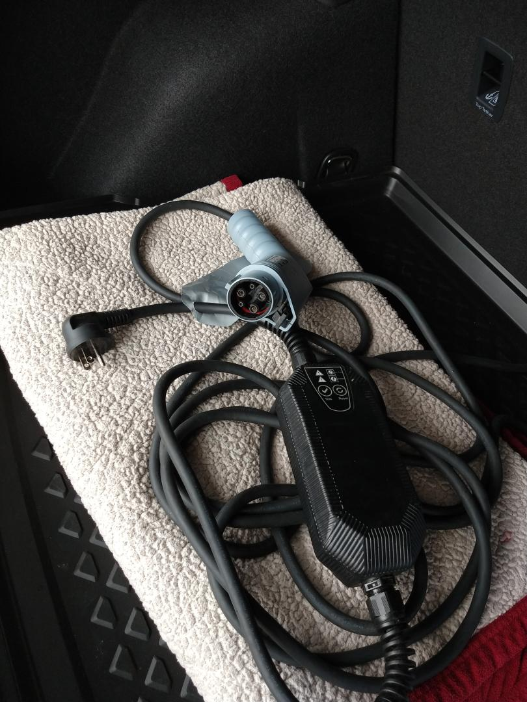
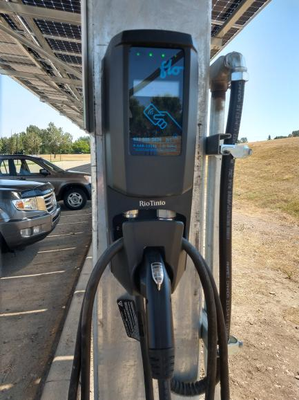
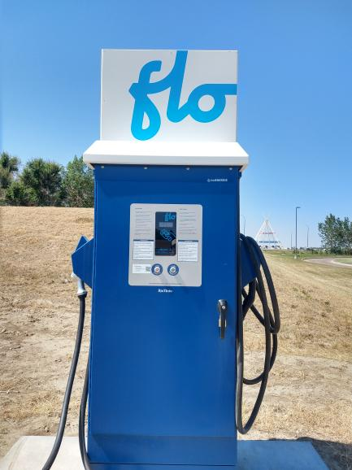
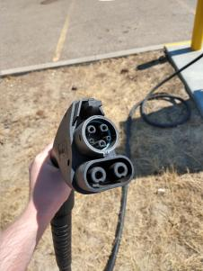
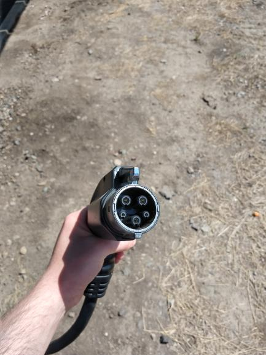

---
output:
  html_document: default
  pdf_document: default
---

<style type="text/css">

  a {
    color: #2196F3;
  }

  .charge-plugs {
    float: left;
    width: 40%;
    margin: 20px 20px 0px 0px;
    background-color: ;
    border: 1px solid #C0C0C0;
    border-radius: 5px;
    box-shadow: 1px 1px 6px 2px #D8D8D8;
  }
  
  .chargers {
    float: left;
    width: 25%;
    margin: 20px 20px 0px 0px;
    background-color: ;
    border: 1px solid #C0C0C0;
    border-radius: 5px;
    box-shadow: 1px 1px 6px 2px #D8D8D8;
  }
  
  #home-charger {
    width: 50%;
    margin: 20px 20px 0px 0px;
    background-color: ;
    border: 1px solid #C0C0C0;
    border-radius: 5px;
    box-shadow: 1px 1px 6px 2px #D8D8D8;
  }
  
  img {
    width: 100%;
    border-bottom: 1px solid #C0C0C0;
  }
  
  figcaption {
    caption-side: bottom;
    margin: 5px;
  }
  
  .tabset-dropdown > .nav-tabs.nav-tabs-open:before { 
    content: none; 
    font-family: 'Glyphicons Halflings'; 
    display: inline-block; 
    padding: 10px; 
    border-right: 1px solid #ddd; 
  }

  .main-container {
    max-width: 940px;
    margin-left: 0;
    margin-right: auto;
  }
</style>


```{r echo = FALSE, message=FALSE, warning=FALSE, include=FALSE}
library(tidyverse)
library(knitr)
library(kableExtra)
df = read_csv("data.csv")
chargetimes = read_csv("flo_charge.csv")
```

### {.tabset}

#### Consumer {.tabset .tabset-fade .tabset-dropdown}

##### How much does an e-golf cost?

The MSRP of a 2019 Volkswagen E-golf is $43,020, plus the following fees and taxes:

- Federal Air Conditioning - $100.00
- AMVIC fee: $6.25
- Tire tax: \$20.00 or $4.00/tire
- Administration fee: $599

<br>

<em>Source: Southland Volkswagen</em>

##### How much does it cost to charge the e-golf?

Using a rate of 12.8 cents/kWh and the  or \$2.15 for a full charge.

Public charging stations are often free, but some charge a flat rate or cost per kWh that is comparable to the cost of charging at home.

<br>

<em>Source: Surveyed Medicine Hat residents for their utility rates.</em>

##### What maintenance do electric vehicles require?

Electric vehicles don't require oil changes, fuel filter replacements, spark plug replacements or emission checks, but still will require regular maintenance of the brakes, tires, coolant and of course the battery.

<br>


##### What type of warranty does the e-golf have?

The warranty for the e-golf is as follows:

- Bumper to bumper coverage for 4 years or 80,000 km
- Powertrain limited warranty for 5 years or 100,000 km
- Corrosion Perforation warranty for 7 years, no kilometer limit
- High voltage system warranty for 5 years or 100,000 km
- High voltage battery warranty for 8 years or 160,000 km (net capacity loss below 70%)

<br>

<em>Source: Canada Warranty and Maintenance booklet
(For more information contact Southland Volkswagen)</em>

##### What type of incentives come with owning an electric vehicle?

As per the iZEV program, the Canadian Federal Government will award rebates for the following amounts (pertaining to the 2019 VW E-golf):

 - \$5,000 for full purchase 
 - \$1,250 for a 12-month lease 
 - \$2,500 for a 24-month lease 
 - \$3,750 for a 36-month lease 

<br>

add date

<em>Source: https://www.tc.gc.ca/en/services/road/innovative-technologies/zero-emission-vehicles.html

[List of vehicles eligible for the iZEV program](https://www.tc.gc.ca/en/services/road/innovative-technologies/list-eligible-vehicles-under-izev-program.html).</em>

#### Charging {.tabset .tabset-fade .tabset-dropdown}

##### How long does it take to charge on average?

```{r echo = FALSE, message=FALSE, warning=FALSE, include=FALSE}
b = chargetimes %>% 
  summarise(averageChargeRate = mean(chargetimes$`Charge rate (kWh/min)`),
            minChargeRate = min(chargetimes$`Charge rate (kWh/min)`),
            maxChargeRate = max(chargetimes$`Charge rate (kWh/min)`)
            )

low = b %>% pull(averageChargeRate) %>% signif(2)
high = b %>% pull(maxChargeRate) %>% signif(2)
avg = b %>% pull(averageChargeRate) %>% signif(2)
```

There are 3 levels of charger. The scope of this project only included data collection for a level 2 charger:

- <strong>Level 1 (110V):</strong> A full charge takes 8 - 20 hours 

- <strong>Level 2 (240V):</strong> From 33 charges in our dataset using a Flo X2 level 2 home charger
  - the average charge rate was <strong>`r avg` kWh/min</strong>
  - the lowest charge time was <strong>`r low` kWh/min</strong>
  - and the highest charge rate was <strong>`r high` kWh/min</strong>
  - The E-golf battery capacity is <strong>35.8kWh</strong>, meaning the average theoretical full charge time is <strong>5 hours</strong>, the longest charge time is <strong>8.5hrs</strong> and the quickest charge time is <strong>3.5hrs</strong> 
<p></p>
- <strong>Level 3 (480V):</strong> A full charge takes 30 minutes to charge a vehicle to 80%

<em>Source for level 1 and level 3 Charger info: http://www.mto.gov.on.ca/english/vehicles/electric/charging-electric-vehicle.shtml</em>

<div class="chargers">
<figure>

<figcaption>A level 1 portable charging cord is included with the E-Golf.</figcaption>
</figure>
</div>

<div class="chargers">
<figure>

<figcaption>A Flo Level 2 Charger installed at Medicine Hat College.</figcaption>
</figure>
</div>

<div class="chargers">
<figure>

<figcaption>A Flo level 3 charger installed at Medicine Hat College.</figcaption>
</figure>
</div>

##### What are the options for home charging stations and how much do they cost?

The E-golf comes with a charger that is capable of level 1 charging from a 110V outlet.

Aftermarket charging stations from companies like Flo or ChargePoint are also available, which offer features such as faster charging than a wall outlet alone, longer charging cord, warranty and smartphone compatibility.

<em>Source: owner's manual</em>


<div id="home-charger">
<figure>

<figcaption>The Flo Home X5 level 2 charger allows for smartphone connectivity and can send usage data such as length of charge and power usage.</figcaption>
</figure>
</div>

##### Which chargers are compatible with the e-golf?

The E-golf supports both SAE J1772 (J Plug) as well as CCS charger types, which allows the vehicle to be charged using level 1, 2 (J1772) and 3 (CCS) connectors.

[Plugshare](https://www.plugshare.com/) is a great web application that shows every charging station across the globe and allows filtering for plug designs, charging networks, payment requirements and more.

<br>

<em>Source: https://pulse.vwmodels.ca/2017/06/electric-vehicle-charging-101/</em>

<div class="charge-plugs">
<figure>
  
  <figcaption><em>The CCS charger is a variant of j1772 with additional pins to allow for level 3 charging.</em></figcaption>
</figure>
</div>

<div class="charge-plugs">
<figure>
  
  <figcaption><em>The CCS charger is a variant of j1772 with additional pins to allow for level 3 charging.</em></figcaption>
</figure>
</div>

##### How much does the e-golf cost to drive ($/km)?

```{r echo = FALSE, message=FALSE, warning=FALSE}

x = 41.55/655

val = df %>% 
  mutate(cost = economy * x,
         cost = cost / 100) %>% 
  summarise(CostPerKm = mean(cost, na.rm = T) %>% scales::dollar()) %>% 
  pull(CostPerKm)
```
From our data, the average cost per km is `r val`.

(from a pure fuel persceptive)

when taking into account up front cost, fuel, maintenance (tires, all fluids),  

#### Driving {.tabset .tabset-fade .tabset-dropdown}

##### What is the averge range of the vehicle?

```{r echo = FALSE, message=FALSE, warning=FALSE}
df %>% 
  group_by('Temperature' = cut(start_outside_temp, 5)) %>% 
  summarise(`Max Range` = max(range_start, na.rm = T) %>% round(0)) %>% 
  drop_na %>%
  mutate('Temperature' = Temperature %>% 
           str_remove("\\(") %>% 
           str_remove("\\]") %>% 
           str_replace("\\,", " to ")) %>% 
  kable() %>% 
  kable_styling()
```

<br>

<em>Source: Data collected by MHC</em>

##### What is energy recuperation?

When the vehicle is braked, and when the vehicle is coasting, electrical energy is generated via the electric motor and storwd in the high-voltage battery. This feature is called brake energy recuperation.

<br>

<em>Source: Owners Manual</em>

##### How fast is the e-golf?

Relevant specs of the e-golf are as follows:

<strong>Top speed:</strong> 150 km/h.

<strong>Time to accelerate from 0 - 100 km/h:</strong> 9.6 seconds

<strong>Instantaneous torque:</strong> 214 lb-ft (270 Nm)

<br>

<em>Source: https://ev-database.org/car/1087/Volkswagen-e-Golf</em>

##### What are the drive modes?

The drive modes change the way the e-golf consumes power:

<strong>Normal:</strong> Uses normal drivetrain and air conditioning power consumption. The full power of the electric motor is available. Maximum speed is reduced to 140km/h.

<strong>Eco:</strong> Energy consumption is reduced compared to the Normal driving mode. The power of the electric motor is reduced compared to the normal driving mode. Climatronic<sup>1</sup> heating and cooling is optimized for consumption. Maximum speed is reduced to 120km/h.

<strong>Eco-Plus:</strong> The power of the electric motor is reduced beyond that of Eco mode. Climatronic<sup>1</sup> heating and cooling is disabled, but defrost and ventilation are still available. Maximum speed is reduced to 95 km/h.

<br>

<em>Source: Owners Manual</em>

<em>1. Climatronic refers to the vehicle's automatic climate control function, which allows the internal temperature to be set at a certain degree value.</em>

##### How does temperature affect the range of the e-golf?

```{r echo = FALSE, message=FALSE, warning=FALSE}

df %>% 
  ggplot(aes(x = start_outside_temp, y = range_start)) + 
  geom_point(alpha = 0.15) + 
  geom_smooth(method = "lm", se = F) + 
  theme_minimal() + 
  theme(panel.grid = element_blank()) + 
  labs(x = "Temperature", y = "Range")

```

According to our data (shown above), the predicted range of the e-golf increases as temperature increases.

<br>

<em>Source: Data collected by MHC</em>

##### What is blue score and the Think Blue Trainer?

The Think Blue trainer analyzes your driving and utilizes a visual display to help you adopt a more energy efficient driving style. Blue score is the metric used to rate your driving style efficiency.

<br>

<em>Source: Owners Manual</em>

#### Driver Feedback {.tabset .tabset-fade .tabset-dropdown}


##### How does the car feel to drive?

<strong>Driver 3:</strong> So quiet, and so smooth to drive! I loved it.

<strong>Driver 6:</strong> Good, was smooth and felt clean and less bulky than my gas vehicle. There were a few times when it didn't start fully which were confusing, but otherwise it was awesome.

<strong>Driver 7:</strong> It was super fun to drive, it felt like a go-kart. Plenty of acceleration, good handling, stable on the highway. It was easier to drive than my car, just push the pedal and zoom zoom! All the little features like lane assist and auto-park were neat, but not much more than a gimmick in my experience.

##### Did you feel the car was convenient to drive? Why or why not?

<strong>Driver 3:</strong> Yes, although data collection was a bit of work :P.

<strong>Driver 6:</strong> Yes, it did everything I needed it to do.

<strong>Driver 7:</strong> Charging was interesting - I found that once I started charging it nightly, like my phone, I stopped worrying about range anxiety.

##### Was the infotainment system intuitive to use? Why or why not?

<strong>Driver 3:</strong> Mostly yes, a couple things required searching for but it was overall easy to use.

<strong>Driver 6:</strong> For the most part. Sometimes if I accidentally went to the main screen it took me awhile to get back to the data screen. There are a lot of options on the main screen which are cumbersome to figure out if your attention is divided.

<strong>Driver 7:</strong> Sure, my car doesnt have anything like it to compare to - but I was able to connect my phone and make calls/listen to music without an issue.

##### How likely are you to buy an electric vehicle in the near future?

<strong>Driver 3:</strong> Extremely likely. It would save tons of money on gas! Even brand new, the price is similar to other gas models. For example, a brand new Ford Flex is also around $50,000.


<strong>Driver 6:</strong> I'd like to, but need the range to increase a lot before it would work well for my lifestyle. I also need to do more research (or have it made readily available by VW?) on the batteries - warranty, lifespan, how environmentally damaging this battery is compared to conventional batteries in terms of mining, disposal etc. I just don't know enough yet.

<strong>Driver 7:</strong> Pretty unlikely, simply because my car still has a lot of miles left to go on it. When the time comes to buy something, I'll definitely look at whats available. 

##### What was your favorite part about driving the car?

<strong>Driver 3:</strong> It's really fast! Almost got a few speeding tickets.. :P

<strong>Driver 6:</strong> Flooring it, for sure!

<strong>Driver 7:</strong> Taking my dad for a drive and showing him how quiet it is!